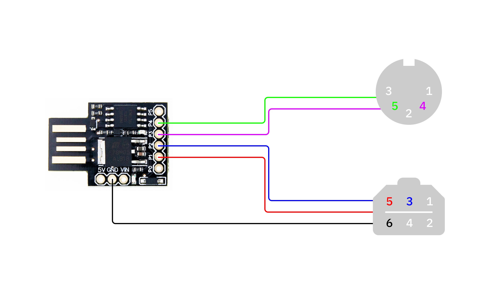
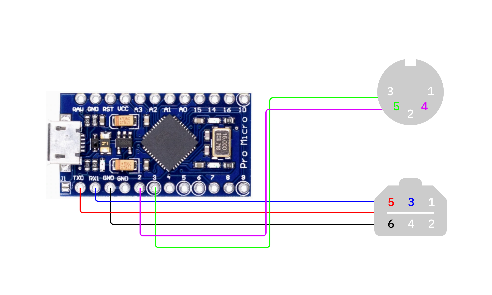
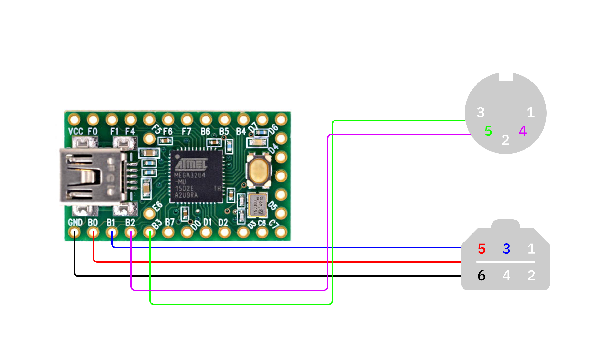

# Pocket Midi

Since the [Analogue](https://analogue.co)'s production of Pockets and Pocket accessories seems to be delayed till 2023. Here's a DIY solution to sync the built-in Nanloop ROM with your other USB/DIN Midi devices.

I prefer the [Digispark](#digispark) given the small form factor, however, it takes a bit more hustle to get everything working. But the size and [price](https://www.aliexpress.com/premium/digispark.html?d=y&origin=y&catId=0&initiative_id=SB_20211223143934&SearchText=digispark) can't be beat, epecially for a use case like this.

However, If you're looking for something a bit easier to get going with a larger form factor you can also compile this code for the [Arduino Micro](#arduino-micro), [Teensy](#teensy) platforms, or any microcontroller with [**ATmega32U4**](https://www.microchip.com/en-us/product/ATmega32U4) chip.


### 📝 Caveat

I'm using MacOS 12.0.1 so the following steps and commands apply to this setup. For those on Windows and Linux, you may have to tweak in ways that I can't help with.


### ⚡️ Compiling and Flashing

| Platform          | Commands                                        |
| ----------------- | ----------------------------------------------- |
| Digispark         | `$ ./build.sh` or<br>`$ ./build.sh digispark-tiny` |
| Arduino Pro Micro | `$ ./build.sh pro-micro`                        |
| Teensy            | `$ ./build.sh teensy`                           |


---

### GB link port pinout

There are [many sources](https://www.google.com/search?q=GB+link+port+pinout&rlz=1C5CHFA_enUS895US895&sxsrf=AOaemvL7MNx7f8Dzqz1XmOkQOYOG9dKJZA:1642960835726&source=lnms&tbm=isch&sa=X&ved=2ahUKEwiyxviHusj1AhUCkokEHdXqCPkQ_AUoAXoECAEQAw&biw=1680&bih=914&dpr=2) to find the pinout of the Game Boy serial port, but I'm including it here too. It's worth noting that color coding of wires is often called out, but that's not the most reliable means of identifying which pin corresponds to which color. When in doubt; test, test again, connect :)

| Pin | Description      |
| :-: | ---------------- |
| 1   | 3.3V / 5V (GB/C) |
| 2   | Serial out       |
| 3   | Serial in        |
| 4   | Serial data      |
| 5   | Serial clock     |
| 6   | Ground           |

### Digispark



I've found that for uploading to the Digispark a USB hub is necessary. A simple USB-A to USB-C adapter seems to be ineffecient resulting in the following error: `Run error: Device not configured has occured ...`

**Updating Firmware**

The following may be unecessary and/or overkill, but I'm including this here for the sake of completeness. I blatantly stole the following from [Koen Vervloesem](https://koen.vervloesem.eu/blog/how-to-upgrade-the-micronucleus-bootloader-on-the-digispark/
) (thank you Koen! 🙏), but changed some of the commands to work for my afformentioned setup.

You'll need [`libusb`](https://libusb.info/) in order to make this update. I recommend using [`brew`](https://brew.sh/), because life's just easier that way.

```
brew install libusb
```

If you're squared away with [`libusb`](https://libusb.info/), move forward to getting and installing the latest version of [micronucleus](https://github.com/micronucleus).

```bash
$ cd ~/downloads
$ git clone https://github.com/micronucleus/micronucleus.git
$ cd ./micronucleus/commandline
$ make
$ sudo make install
```

Run a test `micronucleus --help` to confirm you've had success. Obvviously I'm a fan of [platformio](https://platform.io), but if you're keen to use the Arduino IDE for future Digispark based projects, you might as well update that package as well.

```bash
$ cd ~/Library/Arduino15/packages/digistump/tools/micronucleus/2.0a4
$ mv ./micronucleus ./micronucleus.original
$ cp /usr/local/bin/micronucleus .
```

Finally you can update the firmware with the following:

```
$ cd ~/downloads/micronucleus
$ micronucleus --run firmware/upgrades/upgrade-t85_default.hex
```

Refer to the [source](https://koen.vervloesem.eu/blog/how-to-use-the-digispark-with-micronucleus-bootloader-in-the-arduino-ide/) for more details.


### Arduino Pro Micro/Leonardo




### Teensy



---
### References

- https://koen.vervloesem.eu/blog/how-to-build-avr-code-for-the-digispark-with-platformio/
- https://koen.vervloesem.eu/blog/how-to-use-the-digispark-with-micronucleus-bootloader-in-the-arduino-ide/
- http://little-scale.blogspot.com/2011/08/usb-midi-game-boy-sync-for-16.html
- https://camo.githubusercontent.com/dafff4498189c791b33355013358623bad6c9dc908a6750047f9991ab0ded7f0/68747470733a2f2f696d616765732d7769786d702d6564333061383662386334636138383737373335393463322e7769786d702e636f6d2f692f30393935663761362d373330622d343864302d383631322d6334343038643135653834642f64633768346e332d35316536333839632d356638362d346662322d613761642d3334663735663637323030332e706e67
- https://www.pjrc.com/teensy/pinout.html